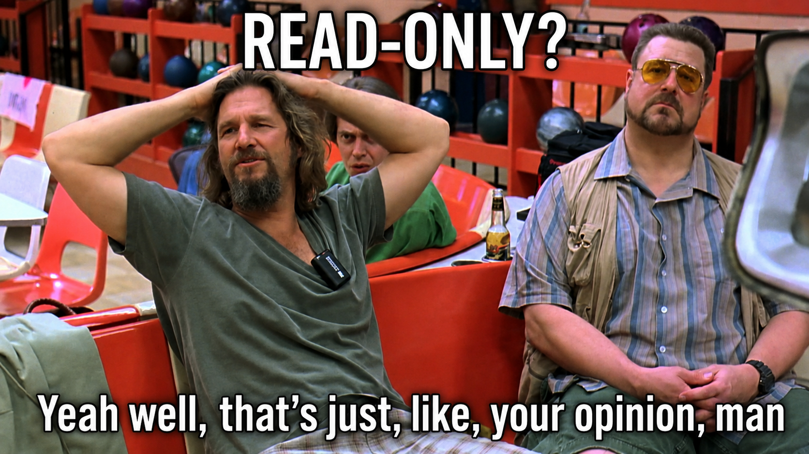
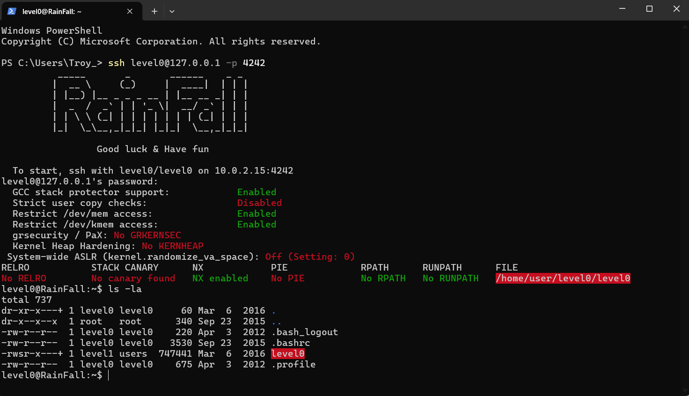
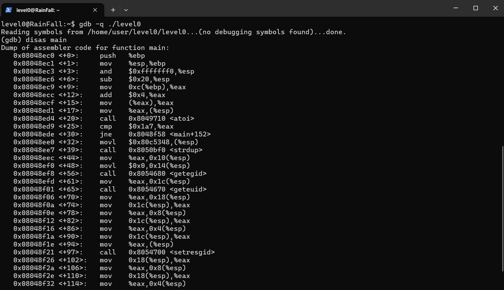
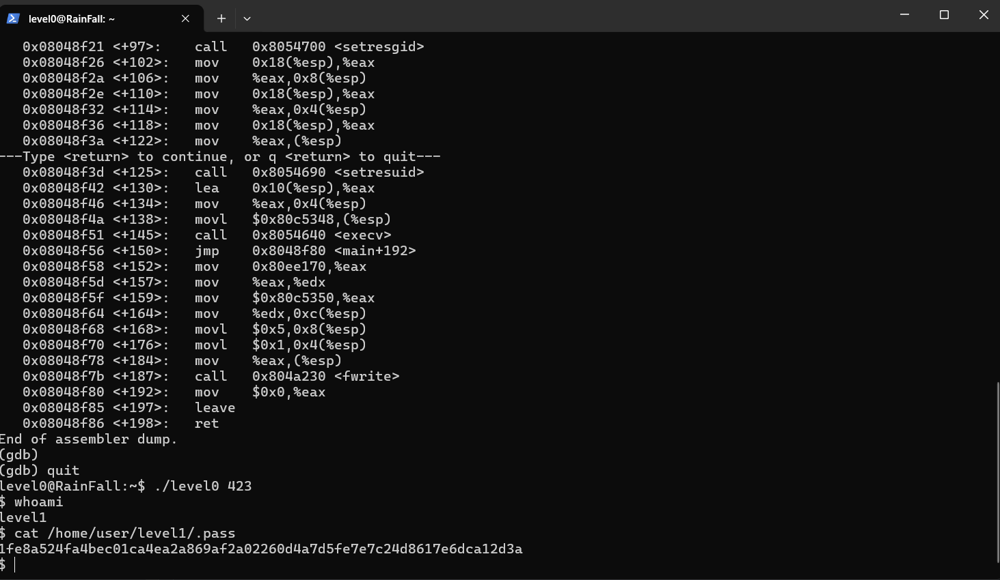

# Rainfall
ELF binary exploitation project in 42's advanced curriculum

_Co-created with @HaruSnak_

 

 

---

## What is Rainfall?

Rainfall ..drops.. you into a deliberately vulnerable CLI-only Linux VM and asks you to essentially break your way through it by way of reverse engineering compiled binaries ultimately leading to privilege escalation.

Each level contains a compiled binary owned by the "next" user. The goal is to reverse engineer that program, identify a vulnerability and exploit it to gain access via a spawned shell to the following account. As the levels progress, the weaknesses become more ~~tedious~~ complex and require an increasingly intimate understanding of how C programs behave once compiled.

The project covers practical concepts including buffer overflows, format-string vulnerabilities, memory corruption, shellcode, return-address manipulation, privilege escalation and return-to-libc techniques.

## From a drip to a trickle to a torrent

Without having source code explain what was happening, I used GDB, objdump and Linux command-line tools to inspect each executable at runtime and at assembly level - following program flow, examining registers and stack memory, locating user-controlled data and determining where that data could influence execution.

Exploitation ranged from calculating precise stack offsets and overwriting return addresses to abusing unsafe formatting functions and redirecting execution toward existing functions or injected code. More importantly, the project provided an up close and personal view of why memory-safety vulnerabilities are dangerous. It connected concepts such as the call stack, registers, addresses, process privileges and C memory handling with real exploitation techniques, turning what can otherwise be fairly abstract security theory into something directly observable and reproducible.

Overall, it tied together the call stack, registers, memory addresses, process privileges and C memory handling with real exploitation techniques, making the low-level security concepts much easier to understand in practice.

 

 

 

 

_Surprisingly dry for something named after water, don't you think_?
